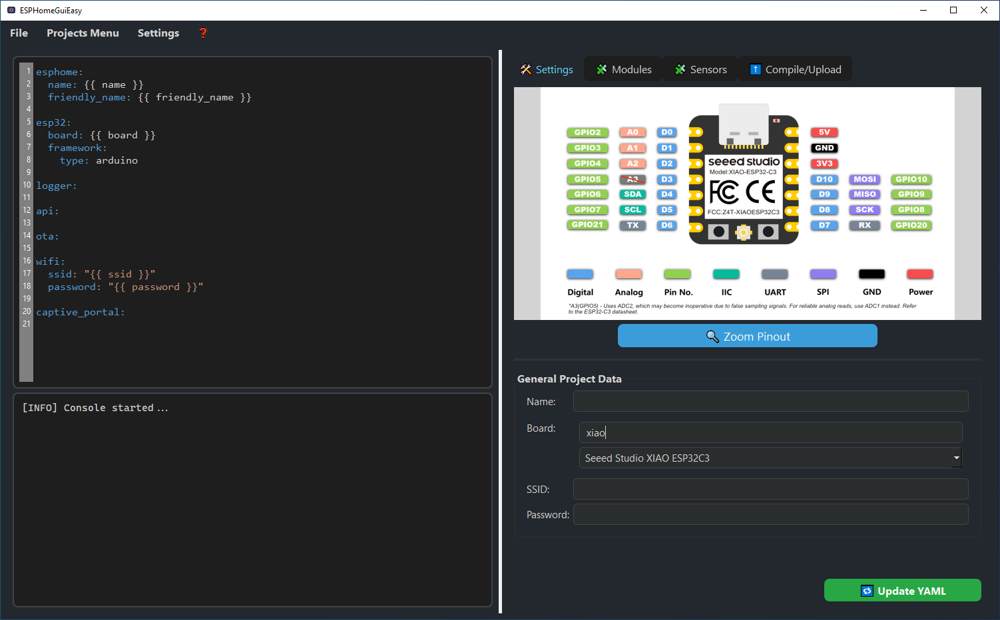

# esphomeGuieasy


[](https://www.paypal.com/donate/?hosted_button_id=HVA3DZFRLW9NU)

> If this project helped you, you can support the development via PayPal donation!

---

📌 [Full changelog available here](CHANGELOG.md)

---
📝 Description

**ESPHomeGUIeasy** is a standalone desktop application written in Python with a modern PyQt6 interface, designed to simplify how you create, configure, and deploy firmware for **ESPHome-compatible devices** (ESP32, ESP8266, etc.).

It provides a full **visual workflow** — from device configuration to firmware flashing — with no need to write YAML manually (but you can if you want to).

Whether you're a beginner in home automation or a power user managing multiple devices, ESPHomeGUIeasy makes the process easier, faster, and more organized.

---

## 💡 Key Features

- 🧱 **Visual “block-style” editor**  
  Drag & drop preconfigured sensor/action blocks — no YAML syntax needed

- ✍️ **Live YAML preview & editing**  
  The interface updates YAML as you go — and you can still tweak it manually

- 🖥️ **Cross-platform UI**  
  Clean and responsive PyQt6-based GUI, available in multiple languages (EN, IT, ES, DE)

- 📄 **Project Manager** *(since v1.4.0)*  
  Organize projects by category with metadata, changelogs, and quick actions

- 🔌 **Integrated Flashing**  
  Supports USB and OTA uploads with built-in log viewer

- 🧰 **Console with build logs**  
  Real-time output while building and flashing firmware

- 📁 **Local project folder & YAML structure**  
  Compatible with ESPHome CLI structure

- 💾 **Works out of the box**  
  No Python installation or venv required — ships with Python embedded

---

## 📚 Technical Documentation

- \ref boards "📦 Supported Boards"
- \ref modules_schema "🧱 Modules Schema"
- \ref sensors "🌡 Sensor Definitions"

---

## 💾 Installation

### 🔹 Option 1: Windows Installer

1. Download the `.exe` file from the [Releases](https://github.com/TheWhiteWolf1985/esphomeGuieasy/releases)
2. Run the installer
3. Follow the wizard to complete installation
4. On first launch:
   - You will be prompted to select a language
   - A config database will be created at:  
     `%LOCALAPPDATA%\ESPHomeGUIeasy\user_config.db`
   - Logs will be saved to:  
     `%LOCALAPPDATA%\ESPHomeGUIeasy\esphomeguieasy_log.txt`

> ⚠️ **Note:** SmartScreen or antivirus may falsely flag the installer. Click **"More info" > "Run anyway"**.

---

### 🔹 Option 2: macOS

1. Download the `.tar.gz` file from the [Releases](https://github.com/TheWhiteWolf1985/esphomeGuieasy/releases)
2. Open the downloaded `.tar.gz` file and drag **ESPHomeGUIeasy** into `/Applications`.
3. On first launch:
    - If you see "App is from unidentified developer", right-click the app and select **"Open"**.
    - Accept language selection prompt.

> 🔐 If serial ports do not appear:
> Grant Terminal and App full disk and USB access via **System Settings > Privacy & Security**

---

### 🔹 Option 3: Linux

1. Download the `.tar.gz` from [Releases](https://github.com/TheWhiteWolf1985/esphomeGuieasy/releases)
2. Extract the archive and run the application:
   ```bash
   tar -xzf ESPHomeGUIeasy.tar.gz
   ./ESPHomeGUIeasy/ESPHomeGUIeasy.sh

> 🔐 Grant serial port permissions:
> ```bash
> sudo usermod -aG dialout $(whoami)
> reboot
> ```

> 🛠 Dependencies like Python are bundled. You don’t need to install them separately.

---

### 🔹 Option 4: Running from source (for advanced or hybrid users)

#### 1. Prerequisites
- Python **3.10 or higher**  
- ESPHome installed globally:
  ```bash
  pip install esphome
  ```

#### 2. Clone the repository
```bash
git clone https://github.com/TheWhiteWolf1985/ESPHomeGuiEasy.git
cd ESPHomeGuiEasy
```

#### 3. Create a virtual environment
```bash
python -m venv venv
# Activate:
venv\Scripts\activate       # On Windows
source venv/bin/activate     # On macOS/Linux

```

#### 4. Install dependencies
```bash
pip install -r requirements.txt
```

#### 5. Run the app
```bash
python main.py
```

---

## 🖼 Screenshots

#### 🏠 Main Interface


#### 🧱 Sensor Configuration (Bricks)


#### ⚙️ Compilation and Upload


#### 🔧 Settings Panel


---

## 🧰 Dependencies (bundled in embedded build)

- **PyQt6** — GUI interface
- **ruamel.yaml** — YAML support
- **pyserial** — serial communication

---

## 🛠 Troubleshooting

- **The program doesn't start**
  - Extract all files before running
  - Check antivirus or run from terminal:
    ```bash
    ./ESPHomeGUIeasy > log.txt 2>&1
    ```

- **ESPHome not found**
  - Make sure it's in your `PATH`, or install it:
    ```bash
    pip install esphome
    ```

- **Serial port errors on Linux/macOS**
  ```bash
  sudo usermod -aG dialout $(whoami)
  reboot
  ```

---

## 📁 Project Structure

```
core/        # YAML handling, flashing, logging
config/      # JSON definitions: boards, sensors, modules
docs/        # Doxygen documentation
gui/         # GUI interface (PyQt6)
assets/      # Icons and UI graphics
main.py      # Entry point for the app
```

---

## 🗂️ User Configuration & Logs

All user data is stored in:

- **Windows**: `%LOCALAPPDATA%\ESPHomeGUIeasy`
- **macOS/Linux**: `~/.config/ESPHomeGUIeasy` or `$XDG_CONFIG_HOME/ESPHomeGUIeasy`

Files:
- `user_config.db` — language and startup preferences
- `esphomeguieasy_log.txt` — crash and debug log

You can safely delete this folder to reset the app.

---

## 📜 License

**AGPL v3 with additional terms** – see [LICENSE.txt](./LICENSE.txt)

> ⚠️ This project is released for **personal, educational, and non-commercial use only**.  
> **Commercial use is strictly prohibited** without prior written permission from the author.

---

## 🤝 Contributing

Contributions are welcome via pull request or issue.  
Please report bugs in the [Issues section](https://github.com/TheWhiteWolf1985/esphomeGuieasy/issues) with:
- OS and version
- Python version
- Steps to reproduce the problem
